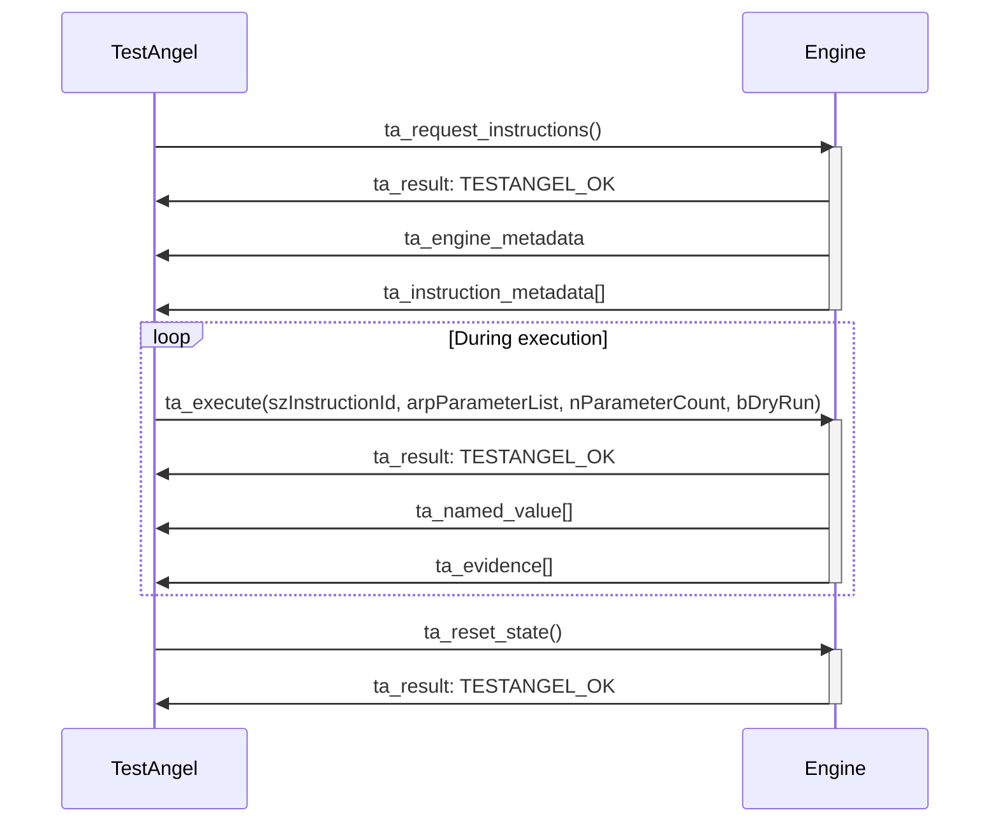

# TestAngel

## Introduction

TestAngel makes automating tests easy by allowing you to make reusable actions that can be used as part of a bigger test process.

In TestAngel, you start off creating a Test Flow. This will be the instructions followed by TestAngel to complete your automation. This flow can then be built up of different actions, which can be provided from two sources. Actions can either come directly from engines, which can perform low-level tasks with systems, for example the HTTP engine can make HTTP requests. Alternatively, actions can come from custom-made complex actions. These are pre-defined flow-within-a-flows that allow complex, repetitive behaviour to be abstracted into it's own self-contained action.

## Parts

| Part | Description |
|:-----|:------------|
|`testangel`|The main executable and UI that controls the platform ("the controller").|
|`testangel-ipc`|The library that contains the serialisable messages that can be exchanged between the controller and the engine plugins.|
|`testangel-engine`|Reusable components shared between engine implementations|
|`testangel-engine-macros`|Macros to ease and simplify writing engines in Rust|
|`testangel-evidence`|An evidence-producing engine plugin.|
|`testangel-rand`|A randomness processing engine plugin.|
|`testangel-time`|An engine plugin for working with time.|
|`testangel-user-interaction`|A user interaction engine plugin.|

## Other Engines

You can install new engines simply by downloading them and dropping them in the `engines` folder.

| Other engine | Description |
|:-----|:------------|
|[`testangel-browser`](https://github.com/lilopkins/testangel-browser)|An engine that can automate the web.|
|[`testangel-oracle`](https://github.com/lilopkins/testangel-oracle)|An engine that can work with Oracle databases.|
|[`testangel-sap`](https://github.com/lilopkins/testangel-sap)|An engine that interfaces with SAP GUI for Windows.|

## Environment Variables

The tool can be configured through a number of environment variables:

| Environment Variable | Description |
|:---------------------|:------------|
| `TA_DEBUG`           | Enable verbose logging |
| `TA_ENGINE_DIR`      | The directory that should be searched through to locate TestAngel engines. By default, `./engines` is used. |
| `TA_ACTION_DIR`      | The directory that should be searched through to locate TestAngel actions. By default, `./actions` is used. |
| `TA_FLOW_DIR`        | The directory that should be suggested to save flows in. |
| `TA_SHOW_HIDDEN_ACTIONS` | If set to `yes`, actions will be shown in the flow editor even if set to hidden. |
| `TA_HIDE_ACTION_EDITOR` | If set to anything other than `no`, the action editor items on the Getting Started screen will be hidden. This can be useful in commercial settings as the action editor is more complex to learn and master. |
| `TA_LOCAL_SUPPORT_CONTACT` | If set, the Getting Started screen will show the value as a contact for obtaining help. Useful for commercial settings. |
| `TA_SKIP_VERSION_CHECK` | If set to `yes`, the check if the latest version is installed will be skipped. |

## Developers: Writing an Engine

If you are a developer in a language with C compatible FFI, you can write an engine. The following provides some details about how it can be achieved.

### Engine Communication

Engines are dynamically linked libraries (`.dll`s on Windows, `.dylib`s on Mac, `.so`s on Linux systems). During their lifetime, their behaviour is typically as the below diagram:



A reference engine can be seen at [`testangel-ipc/demo_c_engine.c`](testangel-ipc/demo_c_engine.c). It should link to `testangel-ipc/testangel.h`, which is generated by running:

```sh
$ cargo build -p testangel-ipc
```

In C, engines should follow the prototypes, of which example are present in the header file. Note that these examples are prefixed with `_`, which shouldn't be present in your engines.

### Writing an Engine in Rust

Writing an engine in Rust is the easiest way to do so, as there are powerful macros making the process feel expressive.

Get started with:

```sh
$ cargo new --lib testangel-demo-engine
$ cd testangel-demo-engine
$ cargo add dynamic-plugin
$ cargo add testangel-engine --git https://github.com/lilopkins/testangel
```

In `Cargo.toml`, add the following lines:

```toml
[lib]
crate-type = ["cdylib"]
```

Then in `lib.rs`, you can start with the boilerplate:

```rust
use testangel_engine::engine;

engine! {
    /// Just a demonstration of how to write an engine in Rust.
    #[engine(
        version = env!("CARGO_PKG_VERSION"),
    )]
    struct Demo;

    impl Demo {
        #[instruction(name = "Demo Instruction")]
        /// Just a demo instruction
        fn demo(
            #[arg(name = "A")] a: i32,
            #[arg(name = "B")] b: i32,
        ) -> #[output(id = "result", name = "A + B")] i32 {
            // You can write almost any code here.
            // You should return the output(s) above, if you need multiple, these should be written as a tuple.
            // The only acceptable types for arguments and outputs are (currently) i32, f64, bool and String.
            // You can use the `?` operator on any code that may return an error, this will be handled cleanly.
            //
            // Two variables exist without being declared, and you can mutate these as desired:
            //     state: &mut Self
            //     evidence: &mut Vec<testangel_engine::Evidence>
            a + b
        }
    }
}
```

You can now simply build your ready-to-ship engine with:

```sh
$ cargo build --release
```
